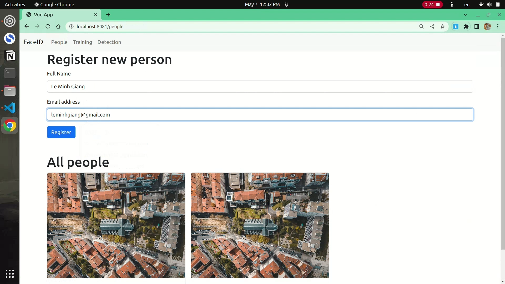
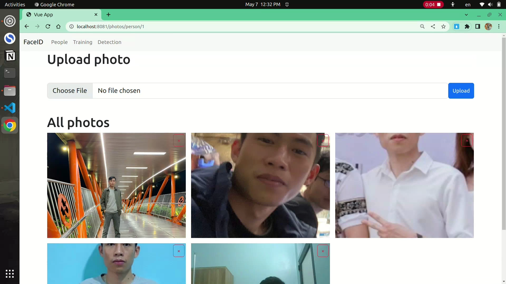
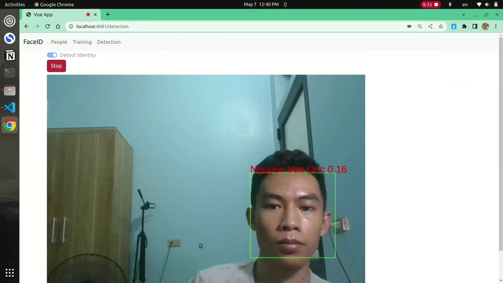
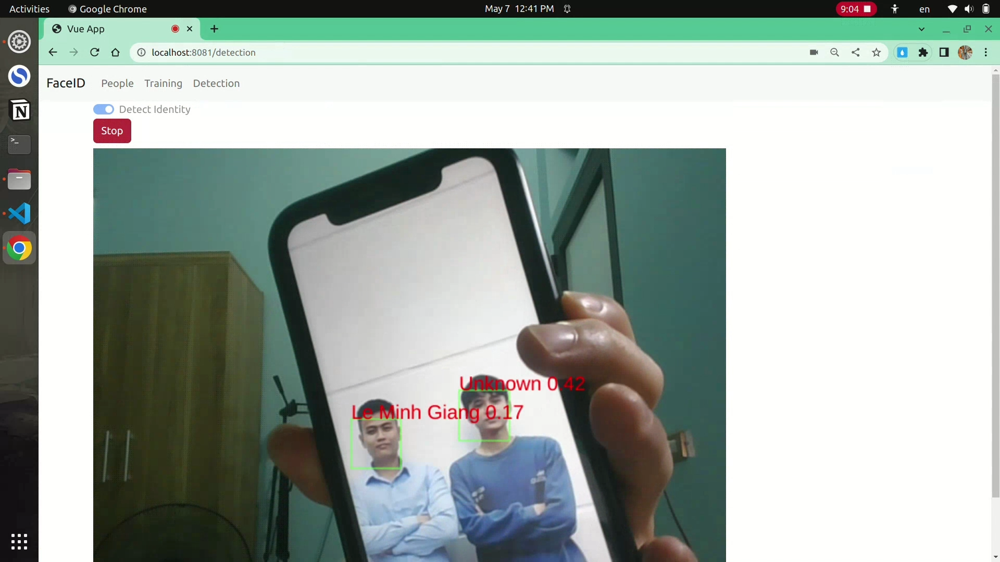
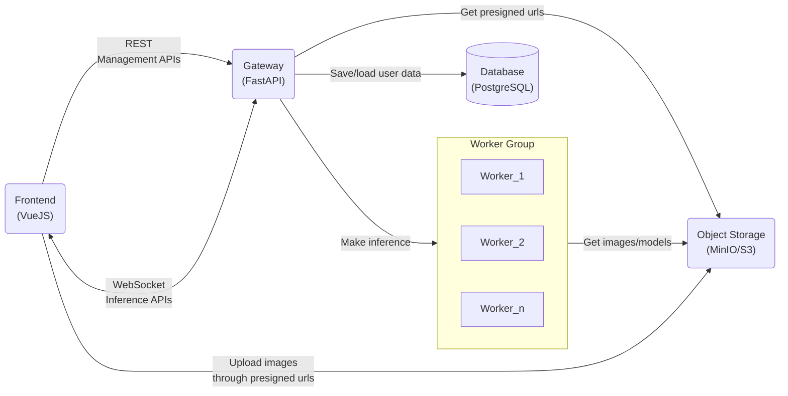

# Cloud-base Face Recognition
This project provides APIs for a face recognition system.

In this project, I focus on how to design a system with high availability and scalability.

## Demo
Demo Video [here.](https://youtu.be/OwbksRAelIc)

Screenshots:





## Run
- Update submodules
```sh
git submodule update --init --recursive
```
- Change configuration at [`gateway/.env`](gateway/.env)
- Run docker compose
```sh
docker-compose -f deploy/docker-compose.yaml up -d
```
- The demo app is served at http://localhost:8081

## API Docs
- The API documentation is served at http://localhost:8080/docs
- Or you can upload [`gateway/openapi.json`](gateway/openapi.json) to [swagger editor](https://editor.swagger.io/)

## System Architecture

## TODO:
- Use Postgresql instead of sqlite for production
- Separates prediction step from gateway for better scalability
- Support API to shows training progress to client
- Frontend: Use docker nginx for deployment
  