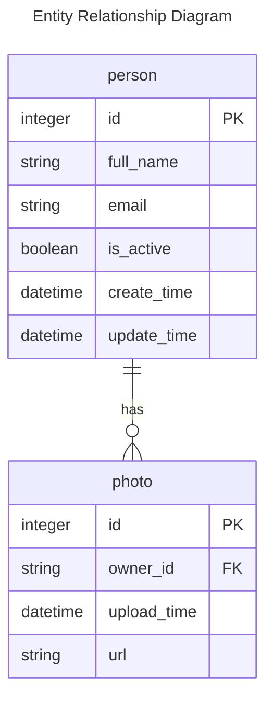

```mermaid
---
title: Entity Relationship Diagram
---
erDiagram
    person ||--o{ photo: has

    person {
        integer id PK
        string full_name
        string email
        boolean is_active
        datetime create_time
        datetime update_time
        
    }

    photo {
        integer id PK
        string owner_id FK
        datetime upload_time
        string url
    }
```